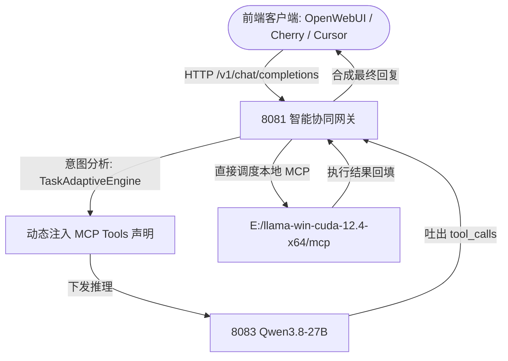

# 本地 MCP 工具集与服务管理手册

> 统一管理目录：`E:\llama-win-cuda-12.4-x64\mcp`  
> 集中配置文件：`E:\llama-win-cuda-12.4-x64\mcp\mcp_servers.json`

---

## 一、本地 MCP 服务总览清单

本机所有 MCP 服务均以标准 Model Context Protocol 规范组织，支持 Cursor、Claude Code、Windsurf、Qwen Code 及 8081 智能网关无缝加载：

| 工具标识 (ID) | 类型 / 命令 | 核心功能 | 随用随开 / 资源状态 |
|:---|:---|:---|:---|
| **`anytxt-mcp`** | Python FastMCP (`anytxt_mcp.py`) | 本地几十万文件**毫秒级全文内容检索** + 离线 OCR 图片文字提取 | 💡 **随用随开节能模式**：平时完全静默释放资源；用时双击 `启动AnyTXT.bat`，用完双击 `关闭AnyTXT.bat` |
| **`bilibili-mcp`** | Python FastMCP (`bilibili_mcp/`) | **B站长视频字幕提取速读**、全站/分区热榜、视频搜索、弹幕评论分析 | 按需调用，轻量极速，免 API Key |
| **`cn-funds-mcp`** | Node.js MCP (`cn-funds-mcp/`) | **中国公募基金盘中估值**、十大重仓股持仓穿透、A股大盘与板块资金流 | 直连东方财富/天天基金公开接口，免 API Key |
| **`hotnews-mcp`** | Node.js npx (`@wopal/mcp-server-hotnews`) | **全网实时热搜聚合**（知乎、微博、B站、36氪、IT之家、抖音等） | 直连各大平台公开接口，零 Key 秒级响应 |
| **`bing-cn-mcp-server`** | Node.js npx (`bing-cn-mcp`) | 必应中文全网搜索 + 网页正文深度抓取 | 自动过滤低质营销号，Node.js 托管 |
| **`local-search-mcp`** | Python FastMCP (`local_search_mcp.py`) | **国内多引擎搜索聚合**（搜狗首选 -> 360备选 -> Bing兜底） | 纯原生 HTML 解析，高可用不依赖外网 |
| **`excel-mcp`** | uvx (`excel-mcp-server`) | 本地 Excel 表格自动化读写、公式处理与图表生成 | 依赖本地 uvx 环境 |
| **`sqlite-mcp`** | Python FastMCP (`sqlite_mcp.py`) | **本地轻量数据库读写/分析**（SELECT/INSERT/查表/Schema查询） | 纯 Python 零依赖，默认对接 personal_memory.db |
| **`sequential-thinking`** | Python FastMCP (`sequential_thinking_mcp.py`) | **思维链逐步动态推导演绎**（支持假设检验、分支思考与回溯修正） | 纯 Python 原生零 Node 依赖，单请求最高 20 步深度规划 |

---

## 二、专项解析：AnyTXT 为什么建议“随用随开”？

### 1. 为什么 AI 建议关闭开机自启？
* **全盘文件变动监控**：AnyTXT 底层后台服务（`ATService.exe`）挂载了 Windows 驱动级文件变更监听（USN 日志与 ReadDirectoryChangesW）。
* **持续的 CPU 与磁盘 I/O 损耗**：当你在电脑上写代码、运行大模型推理、记录日志或进行 Git 操作时，每产生一个新文件，后台就会自动唤醒文本解析器（解包 PDF、Word、Office、TXT 等）重建倒排索引。
* **高负载竞争**：在进行本地大模型推理与微调时，持续的后台磁盘读写会争抢 NVMe SSD 带宽并消耗宝贵的 CPU 核心。
* **结论**：将 AnyTXT 设置为**开机不自启、按需手动开启（DEMAND_START）**是极其明智的优化决策！

### 2. 随用随开极简操作方式
我们在 `mcp/` 目录下准备了两个极简批处理：
* 🟢 **需要检索本地文档时**：双击运行 `E:\llama-win-cuda-12.4-x64\mcp\启动AnyTXT.bat`（或直接打开桌面 AnyTXT Searcher，端口 9920 就绪）。
* 🔴 **检索完毕后**：双击运行 `E:\llama-win-cuda-12.4-x64\mcp\关闭AnyTXT.bat`，即可一秒完全关闭所有后台进程，**100% 释放 CPU 与磁盘资源**！

### 3. `anytxt_mcp.py` 的智能防卡死设计
* 原版 MCP 在 AnyTXT 关闭时会卡住 60 秒直至连接超时报错。
* **新版增强**：内置了 **0.8 秒极速健康探测**。如果检测到 AnyTXT 处于关闭状态，会**毫秒级**返回友好提示：
  > `{"status": "offline", "tip": "AnyTXT 处于随用随开节能模式。如需检索，请运行 启动AnyTXT.bat。"}`
* 同时新增了内置控制工具：
  * `anytxt_status()`：查询服务状态
  * `anytxt_start_service()`：AI 可代用户按需一键后台唤醒
  * `anytxt_stop_service()`：用完即关

---

## 三、8081 网关如何携带与整合 MCP 功能？

用户核心提问：**“网关可以携带 MCP 功能吗？前端扫描到的时候会不会根据 MCP 功能进行工具调用？”**

答案是：**完全可以，而且能够实现远超客户端分散配置的极致体验！**

### 两种携带集成模式对比

#### 模式 A：网关服务端全自动代理执行（Server-Side Auto Tool Execution - 最推荐）
* **工作机制**：
  1. 8081 网关启动时加载 `mcp/mcp_servers.json`。
  2. 任意前端（OpenWebUI、Chatbox、Dify、自带 Web 界面等）向网关发送对话请求，例如：“帮我总结这个 B站 视频 BV1xx411c7mD 的核心内容” 或 “查下 005827 易方达蓝筹的今日估值与重仓股”。
  3. **网关自动把 MCP 工具定义注入模型**。
  4. Qwen3.8-27B 触发 `tool_calls`。
  5. **网关在本地直接执行对应 MCP 工具（如 B站字幕提取或基金接口），拿到数据后自动回填给模型继续生成**。
  6. 前端**完全零配置**，就像对话一样直接收到最终完整答案！

#### 模式 B：网关暴露统一的 MCP SSE 聚合端口（Unified MCP Hub）
* **工作机制**：
  1. 网关在 8081 上对外开放 `/mcp/sse` 端点。
  2. 外部支持 MCP 的专业客户端（如 Cursor、Claude Code、Windsurf）只需配置一个 URL：
     `http://127.0.0.1:8081/mcp/sse`
  3. 客户端一键扫描并接管所有 7 大 MCP 工具，免去在每个软件里繁琐配置 Node/Python 路径的麻烦。

---

## 四、主要 MCP 工具调用范例

### 1. 📺 B站长视频速读 (`bilibili-mcp`)
* “帮我把这个 B 站视频的字幕提炼出来，列出三个核心要点：`BV1Q44y1G7...`”
* “今天科技区前三名的热门视频分别在讲什么？”

### 2. 📈 基金持仓与大盘分析 (`cn-funds-mcp`)
* “查询基金 `012414`（招商中证白酒）今日盘中预估净值与前十大重仓股票。”
* “今天 A 股主要大盘指数表现如何？主力资金流向哪个板块？”

### 3. 🔥 全网热搜早报 (`hotnews-mcp`)
* “获取今天知乎、36氪和微博排名前五的热搜，生成一份早间科技新闻速递。”

### 4. 🔍 本地全文搜索与 OCR (`anytxt-mcp`)
* “在我的本地工作区中搜索包含 'KV Cache 优化' 的文档并提取摘要。”
* “读取并识别本地截图 `E:/test.png` 中的文字内容。”
